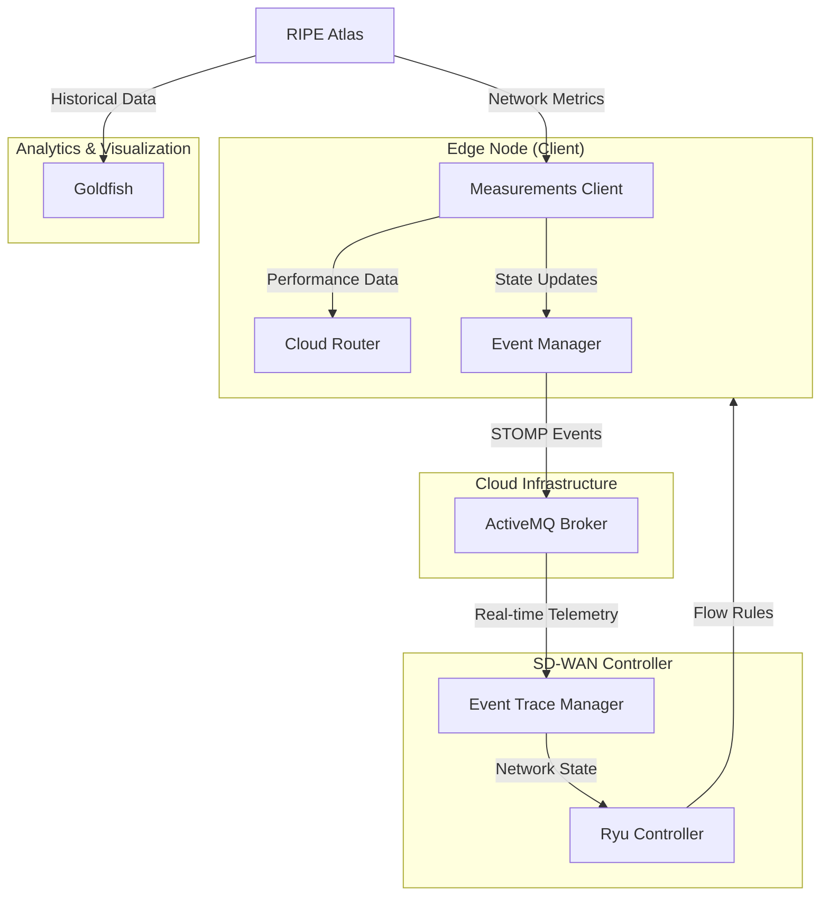

**AWANTA (A**daptive Software-Defined **W**ide **A**rea **N**etwork framework for **T**elehealth **A**ccess) performs inter-domain network transfers for telehealth, in a network latency-aware manner.

## Architecture




# Modules

## measurements_client

The Measurements Client is based on [RIPE Atlas](https://atlas.ripe.net/) and RIPE Atlas Tools. 

### Installation and Configuration

**1. System Dependencies**  
The Mininet emulator relies on OS-level networking binaries (like `mnexec`). Before setting up the python environment, install Mininet on your host machine. For Debian/Ubuntu:
```bash
sudo apt update
sudo apt install mininet
```

**2. Python Environment**  
To set up the full AWANTA Python environment (which includes dependencies for the emulator, controller, and measurements client), we recommend using a virtual environment and executing the provided setup script. The script automatically handles tricky dependencies for the SDN controller on modern Python versions:
```bash
python3 -m venv .venv
source .venv/bin/activate
./setup_env.sh
```

#### Configuring the Measurements Client
To use the measurements client, you **always** need to configure your API key. (Note: The tools are already installed if you ran the full setup above).
```bash
ripe-atlas configure --set authorisation.create=<YOUR_API_KEY>
```
*Note: This command saves your API key securely to `~/.config/ripe-atlas-tools/rc`.*

If you **only** want to run the measurements client on a machine without the rest of the AWANTA components, you can install just those tools:
1. **Install the tools**: `pip install ripe-atlas-tools`
2. **Configure your API key**: `ripe-atlas configure --set authorisation.create=<YOUR_API_KEY>`

The `MeasurementsClient.py` will then automatically use that configuration to execute measurements.

## cloud_router

A decentralized cloud router in all the client nodes.

## event_manager

Propagates the changes in measurements as events to a broker.

## controller

The Software-Defined Wide Area Network (SD-WAN) Controller builds on top of Ryu.

## Running AWANTA

AWANTA can be run using the provided Mininet emulation environment and the Ryu SDN controller. A complete execution involves running both the topology and the controller.

For detailed instructions and prerequisites, please refer to the [Emulator README](modules/emulator/README.md).

### Quick Start

First, ensure your virtual environment is set up and all requirements are installed.

1. **Start the Mininet Emulator**: Run the topology script with sudo privileges to instantiate the network. Since `sudo` resets the path, use the virtual environment's Python executable directly:
   ```bash
   sudo .venv/bin/python modules/emulator/run_topology.py -topo full_mesh_topology
   ```

2. **Start the Ryu Controller**: In a separate terminal, activate the virtual environment and launch the Ryu controller to handle the flow rules and network routing based on the latency data.
   ```bash
   source .venv/bin/activate
   ryu-manager --observe-links modules/emulator/controller.py
   ```

# Citing AWANTA

If you use AWANTA in your research, please cite the below paper:
* Caballero, E. S., Ramirez, J., Alisetti, S. V., Almario, S., and Kathiravelu, P. **Network Measurements for Telehealth Optimizations. Understanding Internet Paths in Remote Regions.** In Cluster Computing – The Journal of Networks Software Tools and Applications (CLUSTER). June 2025, Volume 28, Issue 6, Springer. https://doi.org/10.1007/s10586-024-05069-z
  
* Kathiravelu, P., Bhimireddy, A., and Gichoya, J. **Network Measurements and Optimizations for Telehealth in Internet's Remote Regions.** In the Tenth IEEE International Conference on Software Defined Systems (SDS-2023). pp. 39-46, October 2023. https://doi.org/10.1109/SDS59856.2023.10329044.
