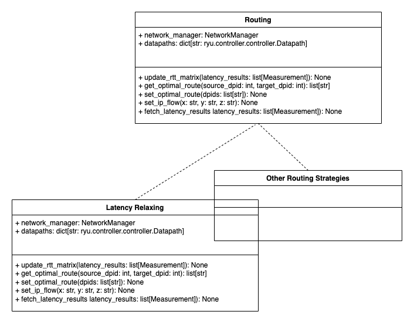
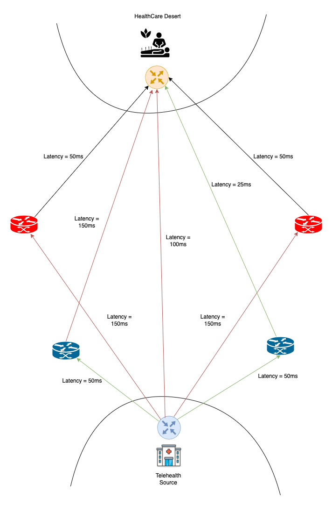

==========
Routing
==========

The routing package is responsible for performing dynamic routing decisions through the SDN controller. Any additional routing strategies are to be implemented in the routing package by extending the ``Routing`` base class and implementing its functions.

Class Diagram
^^^^^^^^^^^^

Algorithms
^^^^^

Latency Relaxing Algorithm
---------

This algorithm performs routing based on the latency values from each node. The update_rtt_matrix function sets the latency values from the trace results into the rtt matrix. The get_optimal_route function then finds the next best one-hop node between source and destination and compares it with the direct link from source to destination. If the one hop node has a better latency then we can go ahead and set the flow to the one-hop node so that subsequent packets flow through this route.

Apart from the direct link, we can see from the image, that the algorithm tries to find the next best one-hop node from the source to the target.

Package
^^^^^^^

.. toctree::
    :maxdepth: 2

    ../src.routing.rst